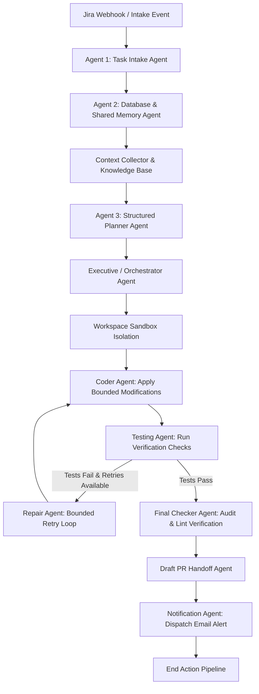

# soft.Engineer

Python MVP for a bounded Jira-to-draft-PR workflow.

The `agents/` package separates deterministic task orchestration from the LangGraph agent flow:

- The SQLite job store owns event receipts, job leases, audit records, and final job state.
- Policy functions decide eligibility and pause work for P0/P1 incidents.
- LangGraph runs one leased job through preflight, context collection, planning, execution, validation, bounded repair, and draft-PR handoff.
- The local adapter is safe demo mode. It does not call Jira or GitHub, change Jira status, write to a repository, or open a real PR.

## Run the MVP

```bash
python3 -m venv .venv
.venv/bin/pip install -r requirements.txt
.venv/bin/python -m agents.main --ticket ENG-101 --priority P3
```

Simulate an active incident pause:

```bash
.venv/bin/python -m agents.main --ticket ENG-102 --priority P3 --incident P0
```

Run the tests:

```bash
.venv/bin/python -m pytest -q
```

## Connect Jira Cloud

The committed [.env.example](/home/surya/Desktop/soft.Engineer/.env.example) is safe to share. The local `.env` file is ignored by Git and must never be committed.

1. Copy the template: `cp .env.example .env`.
2. Set `JIRA_BASE_URL` to your Jira Cloud URL, for example `https://company.atlassian.net`.
3. Create a dedicated bot account with only project browse, issue read, and comment permissions. Do not give it transition, priority, assignee, merge, or administrator permissions.
4. Sign into that bot account and create an Atlassian API token. Put the bot email in `JIRA_EMAIL` and the token in `JIRA_API_TOKEN`.
5. Set `JIRA_PROJECT_KEY` to a dedicated sandbox project key.

Run against a real ticket only after it is manually moved to `Agent Ready`:

```bash
.venv/bin/python -m agents.main --jira-ticket SANDBOX-1
```

The current Jira client fetches the ticket and may add an evidence comment after a draft-PR handoff. It never calls a Jira transition endpoint.

## Core repository knowledge base

Set `CORE_REPOSITORY_PATH` to an existing local checkout. If a local checkout is unavailable, set `CORE_REPOSITORY_URL` to the HTTPS clone URL and run the explicit index command. The indexer clones only when this command is invoked.

```bash
# Preferred: index a local, read-only core-repository checkout.
CORE_REPOSITORY_PATH=/absolute/path/to/core-repository
CORE_REPOSITORY_NAME=demo/repository

.venv/bin/python -m agents.main --index-repository
```

The central SQLite knowledge base records:

- Python modules, classes, functions, and import edges.
- Symbols related to a new ticket's description.
- Prior draft-PR fix records, changed files, validation evidence, and outcome.

This is useful context for the fixer agent, not authority to repeat an old patch. The policy and validation steps still decide whether a fix is safe.

After a human has merged, rejected, or reverted a draft PR, record that outcome in the shared fix history:

```bash
.venv/bin/python -m agents.main --record-fix-outcome SANDBOX-1 --outcome merged
```

## Create safe Jira test tickets

Create a separate Jira project such as `Agent Sandbox`. Do not use production incidents or customer tickets.

1. Create a `Task` or `Bug` in the sandbox project.
2. Use `Low` priority, which this MVP maps to internal `P3` and permits for automation.
3. Add the label `agent-test`.
4. Use a narrow description with acceptance criteria, affected component, expected behavior, and a test command. Do not put credentials, customer data, or access tokens in the ticket.
5. Manually transition the issue to `Agent Ready`. If that status does not exist, add it to the sandbox workflow first. The agent will not create or transition it.
6. Run `--jira-ticket PROJECT-123`, confirm the comment and local audit data, and review the demo draft-PR URL.

Suggested first ticket:

```text
Summary: Add a test for empty display names
Priority: Low
Labels: agent-test

Acceptance criteria:
- Empty display names render as "Anonymous".
- Add a focused unit test.
- Do not change authentication, deployment, or billing code.
```

## System Architecture Diagram


<!-- Verified by Jira Agent for ticket ENG-1 -->
<!-- Verified by Jira Agent for ticket KAN-16 -->
